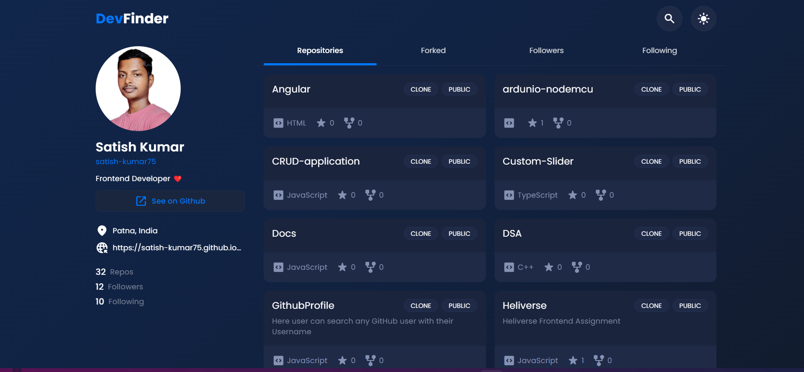

# DevFinder - Navigate the GitHub Universe

## 

---

## Installation

To run this project locally, follow these steps:

1. Clone the repository: `https://github.com/satish-kumar75/DevFinder.git`
2. Navigate to the project directory: `cd GitFinder`
3. Install dependencies: `npm install`
4. Start the development server: `npm run dev`
5. Open your browser and visit `http://localhost:5173` to view the application.
